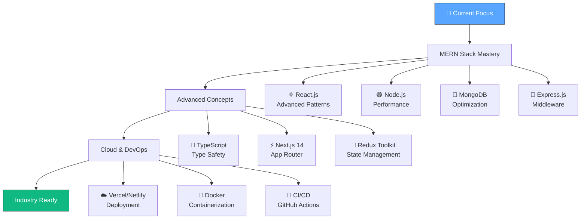

<div align="center">

<!-- Header with animated background -->


<br/>

<!-- Animated typing effect -->


<br/>

<!-- Profile badges with enhanced styling -->


<br/><br/>

<!-- Animated separator -->


</div>

---

##  About Me


<br/>

```javascript
const developer = {
    name: "Prince Bidhuri",
    title: "Full Stack MERN Developer",
    location: "Faridabad, Haryana 🇮🇳",
    email: "this@princebidhuri.com",
    
    currentlyWorking: "Building responsive web apps",
    currentlyLearning: ["Advanced React", "Cloud Tech", "TypeScript"],
    
    technologies: {
        frontend: {
            js: ["React", "Next.js", "Redux", "JavaScript ES6+"],
            css: ["Tailwind CSS", "CSS3", "Responsive Design"]
        },
        backend: {
            js: ["Node.js", "Express.js"],
            database: ["MongoDB"],
            api: ["REST API", "OAuth Authentication"]
        },
        tools: ["Git", "Postman", "VS Code", "Vercel"]
    },
    
    architecture: ["SPA", "SSR","SSG"],
    currentChallenge: "Building scalable full-stack applications 🚀",
    funFact: "I debug with console.log and I'm proud of it! 😄"
};
```

<br/><br/>

---

<div align="center">

##  Connect With Me

<!-- Enhanced contact section with better styling -->
<div>

<a href="mailto:this@princebidhuri.com">

</a>

<br/><br/>

<a href="https://gteck45.cloud/" target="_blank">

</a>

<a href="https://www.linkedin.com/in/princebidhuri/" target="_blank">

</a>

<a href="https://github.com/gteck45" target="_blank">

</a>

<br/><br/>

<!-- Call-to-action section -->
<div style="background: linear-gradient(90deg, #667eea 0%, #764ba2 100%); padding: 20px; border-radius: 15px; margin: 20px 0;">

### 💌 **Ready to collaborate?**
### **Email me:** [`this@princebidhuri.com`](mailto:this@princebidhuri.com)

</div>

</div>

<!-- Animated separator -->


</div>

---

## 💻 Tech Stack & Tools

<div align="center">

### 🎨 Frontend Development


<br/><br/>

### ⚙️ Backend Development  


<br/><br/>

### 🛠️ Tools & Platforms


<br/><br/>

<!-- Enhanced tech badges with animations -->
<div>


<br/>


<br/>


</div>

</div>

<!-- Animated separator -->
<div align="center">

</div>

---

## 🚀 Featured Projects

<div align="center">

<table border="0">
<tr>
<td width="50%" valign="top">

### 🔗 Link Shortener & Profile Sharing
<div align="center">

</div>

<div align="left">

**✨ Key Features:**
- 🔐 **OAuth Authentication** (Google & GitHub)
- 🎨 **Profile Customization** with bio & social links
- 📊 **Link Management Dashboard**
- ⚡ **Server-side Rendering** with Next.js
- 🗄️ **MongoDB** for secure data storage

**🛠️ Tech Stack:** `Next.js` `MongoDB` `OAuth` `Tailwind CSS`

</div>

</td>
<td width="50%" valign="top">

### 🔐 Password Manager App
<div align="center">

</div>

<div align="left">

**✨ Key Features:**
- 🛡️ **Secure Password Storage** with encryption
- 🔒 **OAuth Integration** for authentication  
- ⚛️ **React + Redux** architecture
- 🔌 **RESTful API** communication
- 📱 **Responsive Design** across devices

**🛠️ Tech Stack:** `React` `Redux` `Node.js` `Express` `API`

</div>

</td>
</tr>

<tr>
<td width="50%" valign="top">

### 🎵 Spotify Clone
<div align="center">

</div>

<div align="left">

**✨ Key Features:**
- 🎧 **Interactive Music Player** with controls
- 📱 **Fully Responsive** design
- 🎨 **Pixel-perfect Spotify UI** recreation
- ⚡ **Vanilla JavaScript** performance
- 🎵 **Dynamic Track Listing** functionality

**🛠️ Tech Stack:** `HTML5` `CSS3` `JavaScript` `Responsive Design`

</div>

</td>
<td width="50%" valign="top">

### 🌤️ Weather Application
<div align="center">

</div>

<div align="left">

**✨ Key Features:**
- 🔍 **Real-time Weather Search** by city
- 📊 **Detailed Weather Statistics** display
- 🌐 **WeatherAPI.com** integration
- 💎 **Beautiful UI** with Tailwind CSS
- 🌡️ **Temperature & Forecast** data

**🛠️ Tech Stack:** `React` `Next.js` `WeatherAPI` `Tailwind CSS`

</div>

</td>
</tr>
</table>

<br/>

### 🎯 Additional Projects

<div>

| Project | Description | Tech Stack | Features |
|---------|-------------|------------|----------|
| **✅ ToDo List App** | Task management with persistence | `React` `Tailwind CSS` `LocalStorage` | ✨ CRUD operations, Real-time updates |
| **🧮 Calculator Application** | Advanced calculator with responsive UI | `Next.js` `CSS3` `JavaScript` | 🎯 Arithmetic operations, Mobile-first |
| **🔗 Link Checker Tool** | URL accessibility validator | `HTML` `CSS` `JavaScript` | 🚀 Real-time checking, Status validation |

</div>

</div>

<!-- Animated separator -->
<div align="center">

</div>

---

## 📊 GitHub Analytics

<div align="center">

### 📈 Contribution Stats
<br/>


<br/><br/>

### 🔥 Contribution Streak


<br/><br/>

### 📈 Activity Graph


</div>

<!-- Animated separator -->
<div align="center">

</div>

---

## 🎓 Education & Certifications

<div align="center">

### 🎓 Academic Background
<table>
<tr>
<td align="center"></td>
<td align="center"><strong>IGNOU University</strong></td>
</tr>
<tr>
<td align="center"></td>
<td align="center"><strong>HBSE Board</strong></td>
</tr>
<tr>
<td align="center"></td>
<td align="center"><strong>HBSE Board</strong></td>
</tr>
</table>

<br/>

### 🏆 Professional Certifications

<div>

| 🎖️ **Certification** | 🏢 **Provider** | 📅 **Date** | 🔗 **Credential** |
|:--------------------|:---------------|:------------|:-----------------|
| **MongoDB Bootcamp** | Letsupgrade | May 2025 |  |
| **Node.js Bootcamp** | Letsupgrade | Apr 2025 |  |
| **JavaScript Bootcamp** | Letsupgrade | Mar 2025 |  |
| **HTML & CSS Bootcamp** | Letsupgrade | Mar 2025 |  |
| **JavaScript for Beginners** | Simplilearn | Dec 2024 |  |

</div>

</div>

<!-- Animated separator -->
<div align="center">

</div>

---

## 🌱 Current Learning Journey

<div align="center">

### 🚀 Learning Roadmap 2025



<br/>

### 🎯 **2025 Goals & Objectives**

<table>
<tr>
<td width="50%" align="center">

#### 💻 **Technical Goals**
- 🚀 Master **TypeScript** for type-safe development
- ☁️ Learn **AWS/Cloud** deployment strategies
- 🐳 Get proficient with **Docker** & containerization
- 📱 Explore **React Native** for mobile development
- 🧪 Master **Testing** frameworks (Jest, Cypress)

</td>
<td width="50%" align="center">

#### 🎯 **Professional Goals**
- 💼 Land a **Full-Stack Developer** role
- 🤝 Contribute to **5+ Open Source** projects
- 📚 Build **10+ Production-ready** applications
- 🌐 Launch personal **SaaS products**
- 📝 Start **technical blogging** journey

</td>
</tr>
</table>


</div>

<!-- Animated separator -->
<div align="center">

</div>

---

## 🎭 Fun Facts & Personality

<div align="center">


<br/>

### 🎯 **About My Coding Journey**

<table>
<tr>
<td width="50%" align="center">

**🕒 Coding Schedule**
```
🌙 Night Owl Programmer
⏰ Peak Hours: 10 PM - 2 AM
☕ Fuel: Coffee + Determination
🎵 Vibe: Lo-fi beats & focus music
```

</td>
<td width="50%" align="center">

**🔧 Development Style**
```
📝 Clean & Readable Code
🧪 Test-Driven Development  
🐛 Console.log() Detective
📚 Documentation Enthusiast
```

</td>
</tr>
</table>

<br/>

### 🎯 **Developer Mantras**

<div>

> 💡 **"Code is like humor. When you have to explain it, it's bad."** - *Cory House*

> 🚀 **"First, solve the problem. Then, write the code."** - *John Johnson*

> ⚡ **"Make it work, make it right, make it fast."** - *Kent Beck*

</div>

<br/>

### 🎮 **When I'm Not Coding**

<div>


</div>

</div>

<!-- Animated separator -->
<div align="center">

</div>

---

<div align="center">

## 🤝 Let's Build Something Amazing Together!


<br/>

### 🤝 **Open for Collaboration On:**

<div>

| 💡 **Project Type** | 🎯 **What I Bring** | 🚀 **Let's Create** |
|:-------------------|:--------------------|:-------------------|
| **🌐 Web Applications** | Full-stack MERN expertise | Scalable, responsive solutions |
| **🔧 Open Source** | Clean code & documentation | Impactful contributions |
| **💼 Startup Ideas** | Problem-solving mindset | MVP to production journey |
| **📚 Learning Projects** | Knowledge sharing | Skill development together |

</div>

<br/>

### 📧 **Ready to Connect?**

<div style="background: linear-gradient(45deg, #667eea, #764ba2); padding: 25px; border-radius: 20px; margin: 20px; box-shadow: 0 8px 32px rgba(0,0,0,0.3);">

**💌 I'd love to hear from you!**

<br/>

<a href="mailto:this@princebidhuri.com" style="text-decoration: none;">

</a>

<br/><br/>

**Whether it's a project collaboration, job opportunity, or just a friendly tech chat - my inbox is always open!**

</div>

<br/>

<!-- Social links with enhanced styling -->
<a href="https://gteck45.cloud/" target="_blank">

</a>

<a href="https://www.linkedin.com/in/princebidhuri/" target="_blank">

</a>

<a href="https://github.com/gteck45" target="_blank">

</a>

<br/><br/>

---

<!-- Profile views and final message -->


<br/><br/>

### 🌟 **Thank you for visiting!** 
**⭐ Don't forget to star repositories you find interesting!**

<br/>

**💫 "The best code is written when you're having fun doing it!"**

</div>

<!-- Footer with animated wave -->

